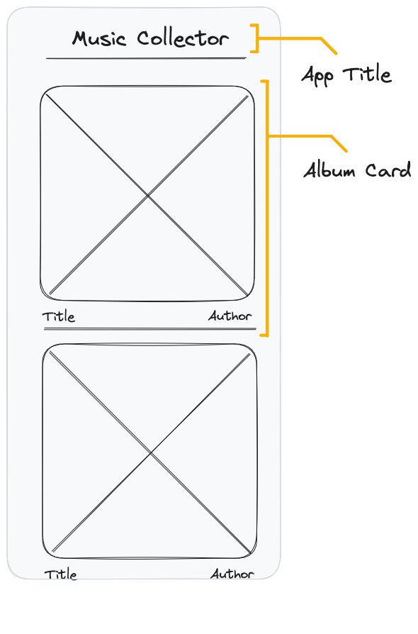
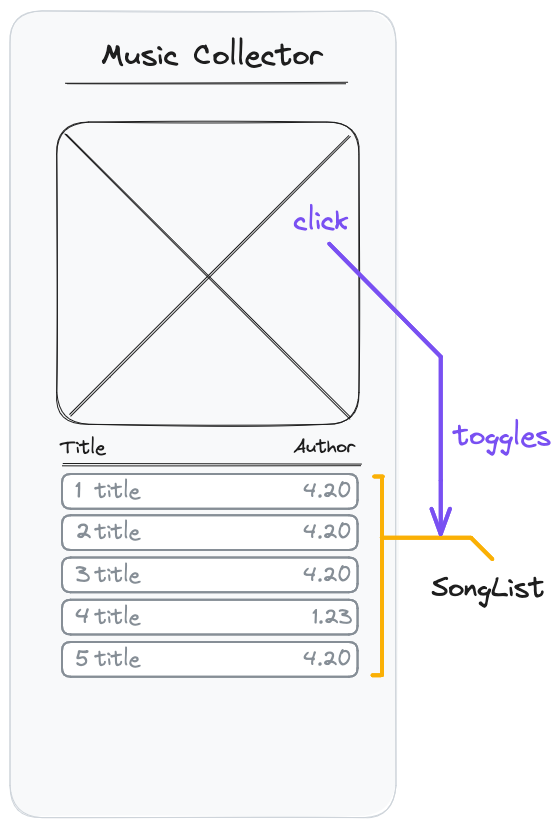
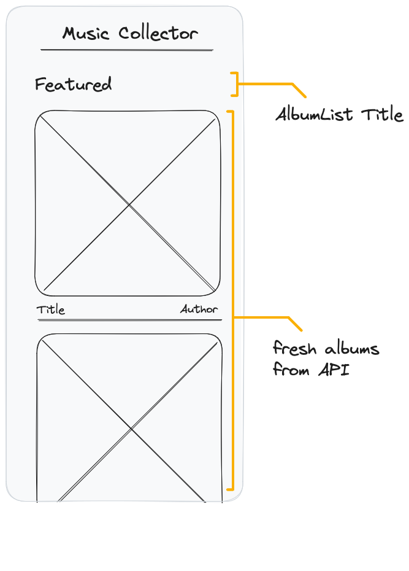

# React Recap Project - Part 1



## Features

The app displays a list of album cards from already available data.

## Acceptance Criteria

- A list of albums is displayed based on the `data` array in `./src/db.js`
- Every album contains the album cover, the album title and interpret
- A title with the name of your app is displayed on top of your app
- For creating the albums cards, a component called `AlbumCard` is created and used

## Notes

- Start your project with using the `npx create-react-app` command. Remove all boilerplate files and start with a fresh empty react project.
- Create a new file called `db.js` inside your projects `src` folder and copy the album data from [this source](../assets/db.js) into it.
- Work on your app in the mobile view of your browser. In firefox, you can activate it with the shortcut `cmd+alt+m`.
- For every component, create a corresponding `css` file with the same name and import it at the top of your component file. Write all styles for the component in this css file.
- Take a look at the data in the `db.js`. How is it structured? What keys belong to what element in the list? Make sure to understand the structure before using it.

# React Recap Project - Part 2



## Features

Each album can be expanded by clicking on the album cover. If expanded, the track list of the album is displayed in the card.

## Acceptance Criteria

- By clicking on the cover of a closed AlbumCard, the card is expanded
- When the card is expanded, a list of songs is displayed
- Every song in the list has a track number, a name and a duration.
- By clicking a second time on the cover, the AlbumCard is closed
- A Component called `SongList` is created and used for rendering the list of songs

## Notes

- Each clickable item on a webpage must be either a link or a button (depending on the use case).
- A button with more than just text as children needs an aria-label for better accessibility.
- You will need a state somewhere in your application to toggle the Card display.

# React Recap Project - Part 3



## Features

Instead of using local data from a database, fetch a "featured" album list from the provided API and display this data.

The API endpoint is

```
https://neuefische-spotify-proxy.vercel.app/api/featured
```

## Acceptance Criteria

- Above the album list, a title with the text `"featured"` is displayed
- A list of album data is fetched and displayed
- the list of albums is refactored into a Component called `AlbumList`
- While loading the data from the API, the album list should be empty

## Notes

- Fetching data is a side effect for our component, so we will need a `useEffect` somewhere
- We provide for you a simplified API for fetching data from Spotify. You still get all data from Spotify, but we removed unnecessary data points.
- You can copy the API endpoint into your browser and take a look at the data that you are fetching
